# JOURNAL
> Total time: 16.6h

## Building an Idea
> Time spent 0.5h

> 23/11/2025 

I open keyboard layout editor to start choosing a layout, i chose the one in the image below and i also want to have a rotary encoder.

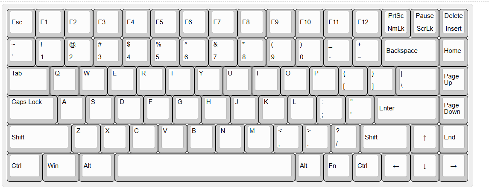

As shown it is a 75% keyboard, i am planning to have a rotary encoder maybe multiple ones.

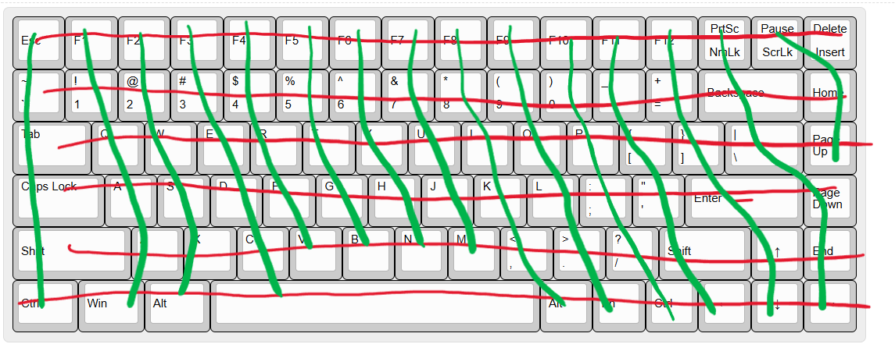
---------------------------------------------
## First hands on Schematic
> 25/11/2025
## MCU
### Controller Chip
For the chip i chose a common chip which is the STM32F072CBT6 is has many GPIOs, i am not sure if it would take everything i need but until now it should work.

I have started giving out labels to the pins just regular names and connected ground pins to ground

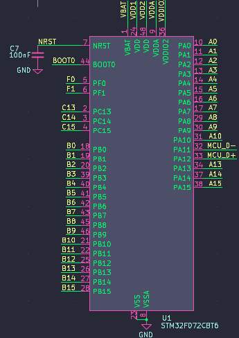

### Decoupling Caps
In decoupling capacitors area i followed the general guides and made very standard connections.

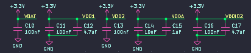

### Boot button
Made a bootloader button circuit.

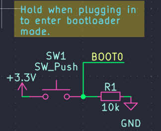 

## Power Supply
### USB-C port
Here i am connecting ground then the data differentials and following standard connection for CC1 and CC2 by pulling them to ground and for vbus i am connecting fuse for current limit

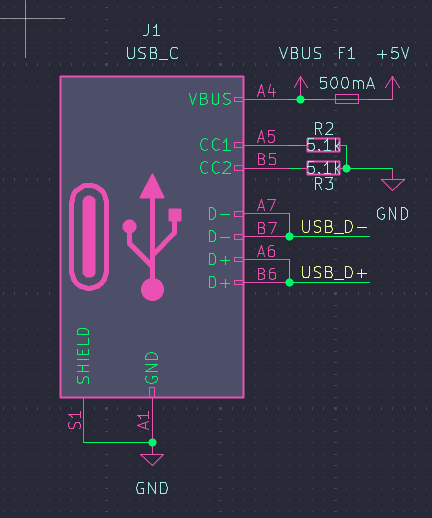

### Static Elect.. Protection
ESD protection circuit, connected from the USB then to the chip for static electricity protection.

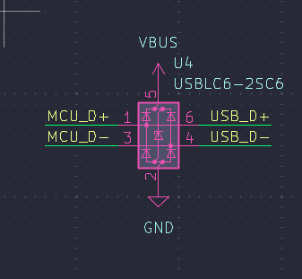

### Voltage stepdown
Finally i made voltage stepdown from USB to 3.3v.

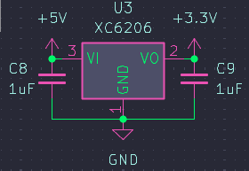

### Misc
At the end i added mounting holes for the keyboard, i stick with 4 holes as i think the keyboard is compact enough for those.

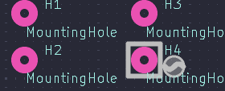

-------------------------------------
## Keyboard Keys Schematic
> 26/11/2025    
### Keys
To start making the key matrix i open a new sheet and i started putting down the 45 angled switch key and the diode, then i copied the same thing for the total number of keys, then i connected the matrix for columns and rows and added the global labels, to finish with the exact number of keys i removed additional ones in the matrix leaving space for shift and spacebar and other keys making the schematic ready to pull into the pcb editor.

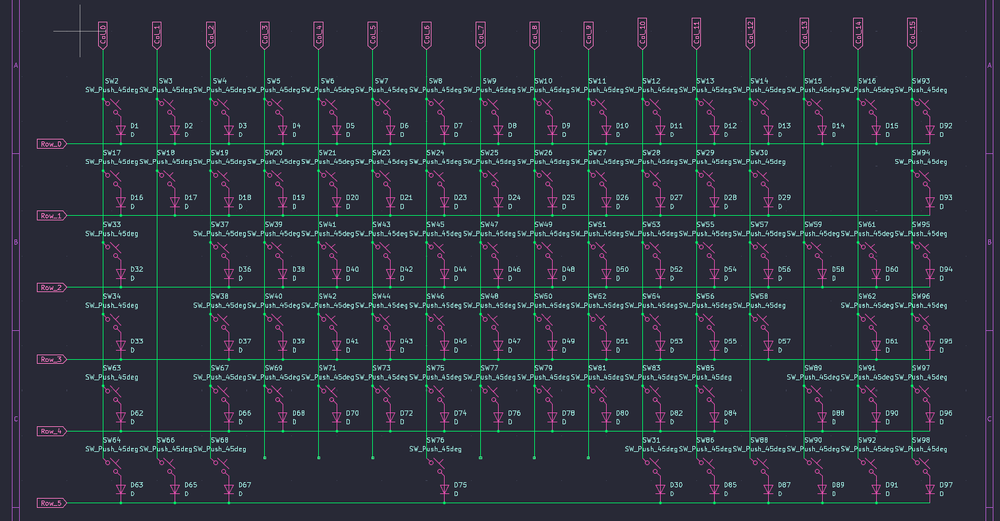

Here is the final result in the main schematic sheet with the global labels

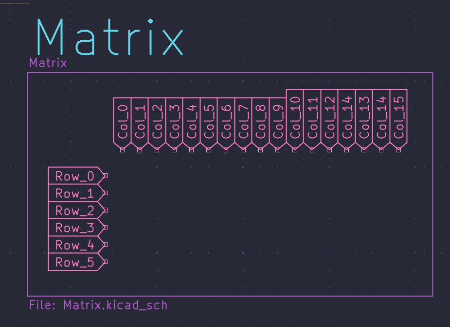

### LEDs
For the addressable RGB leds i use the SK6812, i got the 84 leds for each key on the layout, with that i started connecting them in series, and gave global label for the converted power coming from the MCU.

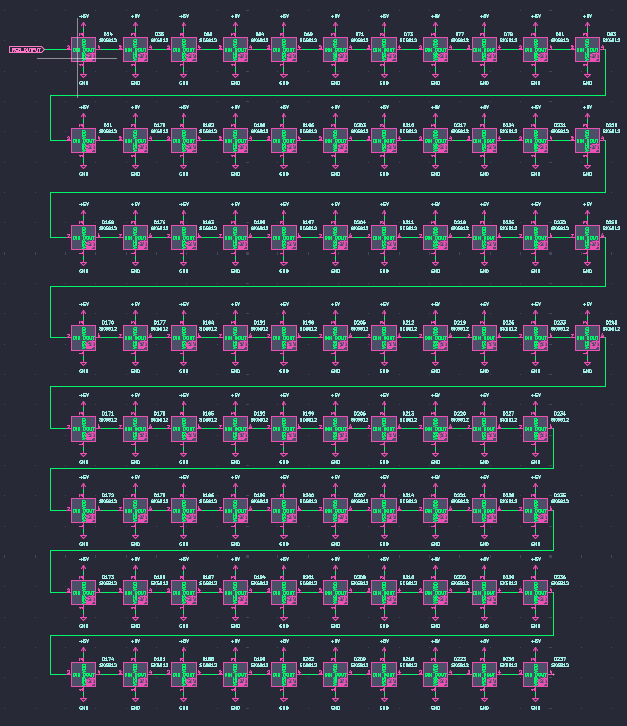

### LED Power Converter
In order to have stable signal coming from the MCU and flowing to the final led without degradation of signal i convert the 3.3v to 5v for the Signal lines, using the 74LVCH2T45DC and connecting in as the following.

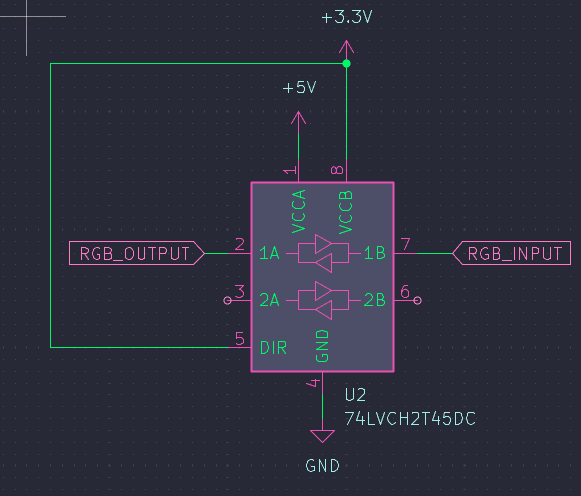

### Rotary Encoder
I have added this rotary encoder gave it a traditional connection i found on a tutorial, i am going to change the labels for the matrix.

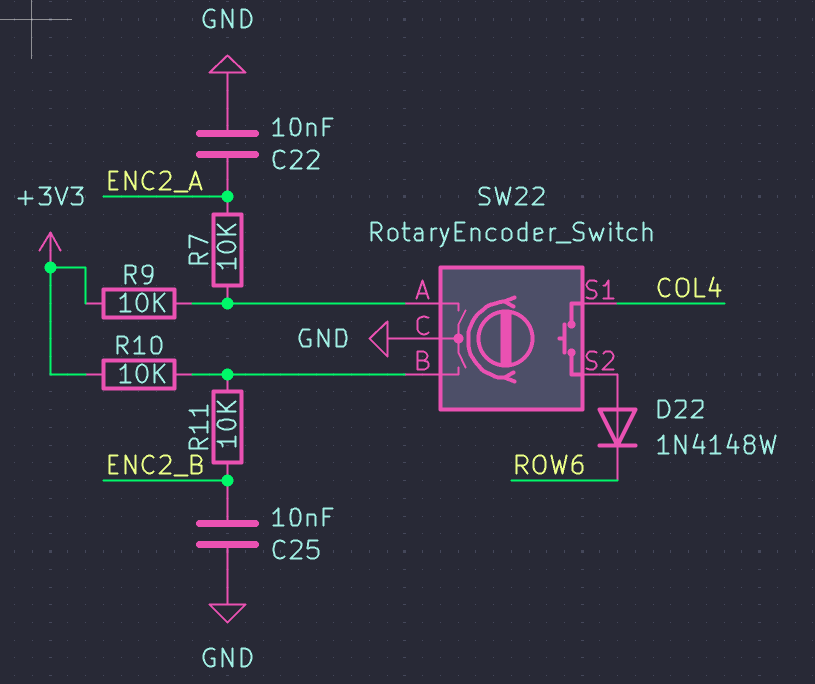

### Schematic Polishing
Making titles and box areas for each part.

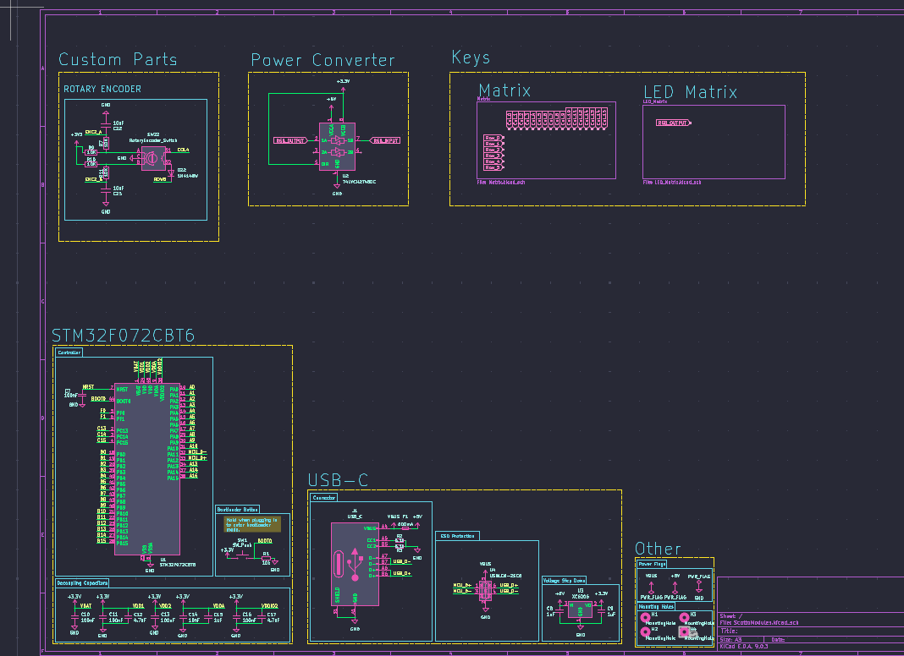

----------------------------------------------
## PCB & Layout
> 28/11/2025
### Schematic addition
I have added additional parts in schematic which are the stabilizers.

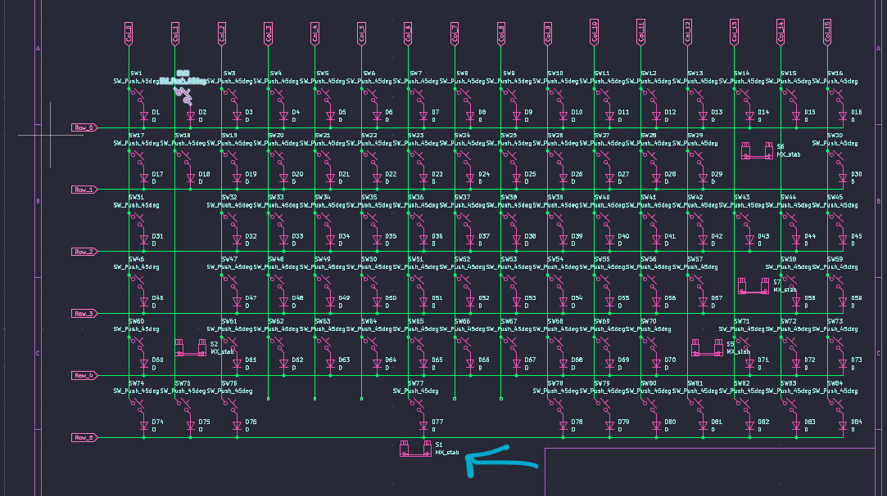

I have changed the leds footprint to the SK mini which are much smaller in size from the main mini.

### PCB Auto Layout
I pulled all components then used the kbplacer plugin for layout, it auto connected some of the columns and rows so i had few left unconnected to connect then i placed the stabalizers according to their sizes.

This process took some time as i had multiple issues when auto placing LEDs using the plugin, for some reason the plugin was not capable of doing it so i had to remove the leds then pull them back after auto placement.

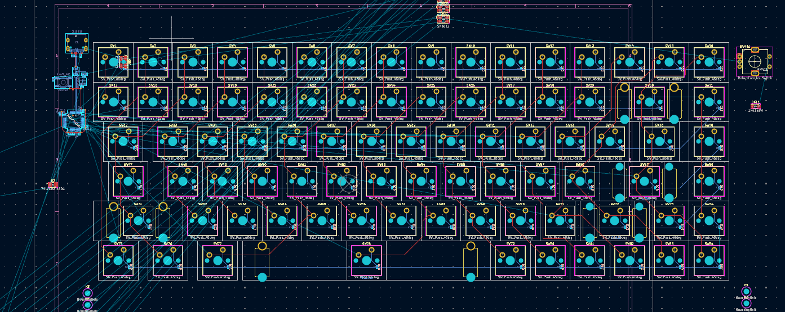

### MCU
The microcontroller was connected to the USB-C from a preloaded template.

----------------------------------------------

## LEDs
> 4/12/2025 

This was the most tiring phase because i realized i was using the wrong led footprint so i had to change the schematic symbol and added the SK mini e reverse mount version of led so i can put it anywhere as it doesn't interfere with the upper layer.

Then i had to place every led in its place below the 3 pin holes and then i started connecting each single power pin to a main +5v power line and repeat that every single led, then i made the same changes again for the ground pins and then try to figure out how to connect the other two (DIN-DOUT) signal pins
so i worked on the inner layers of the board and connect every SINGLE LED which was absolute pain, but at the end i got it all together.

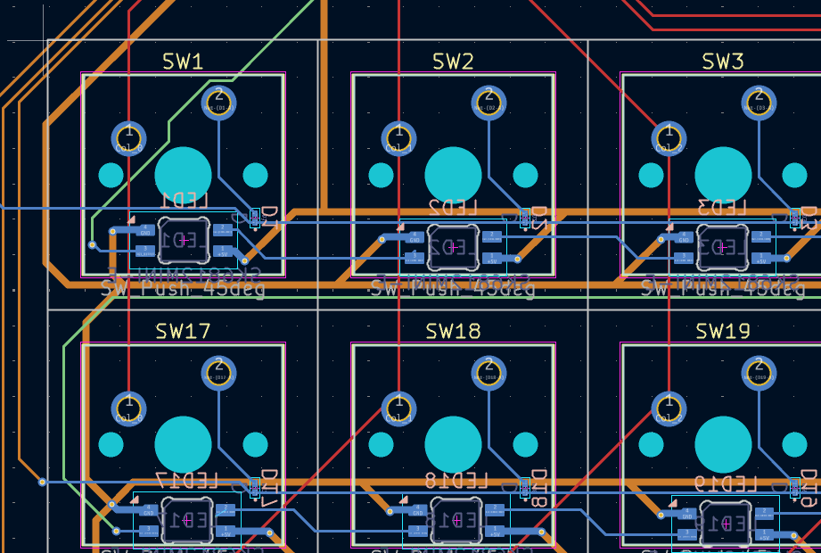

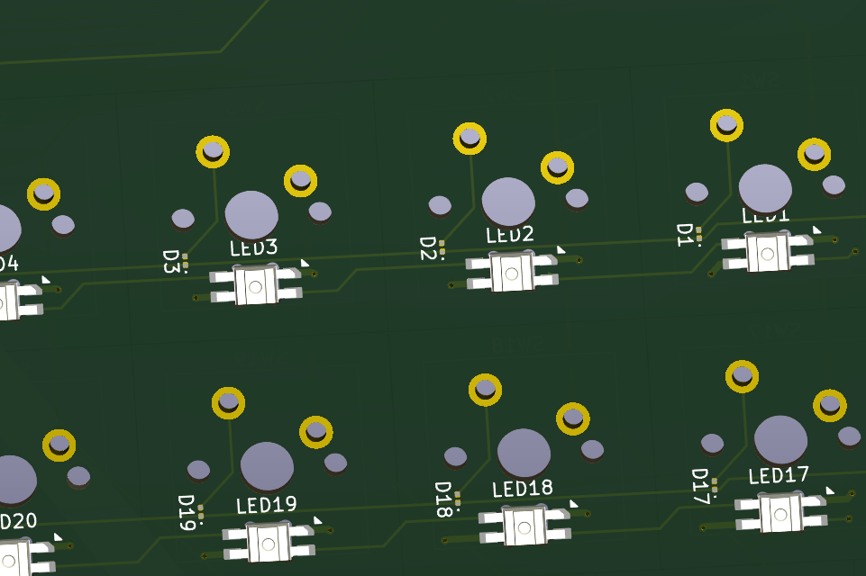

--------------------------------------------
## MCU Connections
> 4/12/2025

I think the image speaks for itself, yes i had to do that and do cross overs which was crazy as somehow the pins where not in correct order for the matrix cols and rows so had to put a lot of vias in order to get it done.

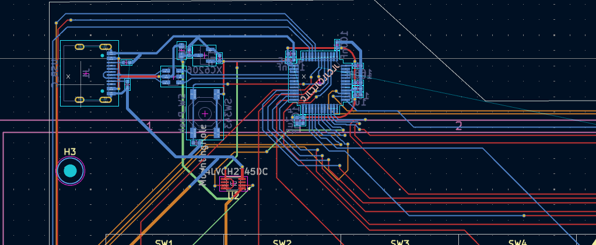

---------------------------------------------
## Keyboard Case
> 4/12/2025
At the end i added my signiture on the front silkscreen and exported the pcb.

This was easy task i am good in CAD so i made a simple flat case no fancy things i made it in Fusion360 and got it done then i rendered the images with the exported PCB.

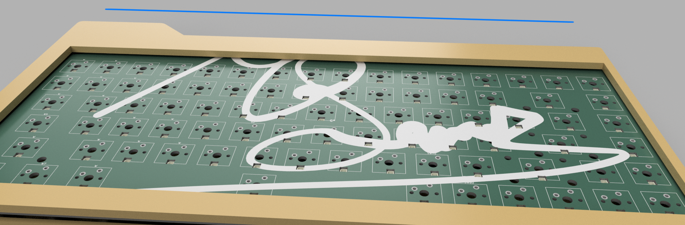

