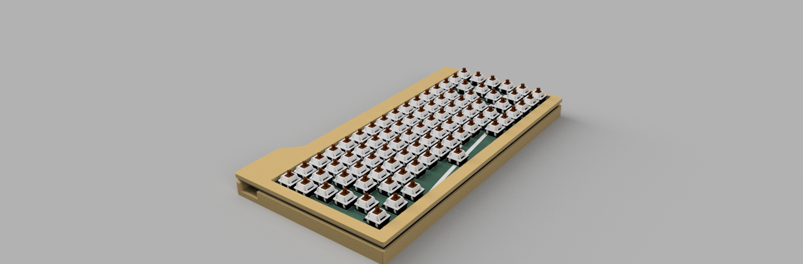

# RGB Mechanical 75% KEEB

This is my custom made rgb mechanical keyboard

## BOM

| Id | Designator | Footprint PCB ONLY | Quantity | Designation | Supplier (LINK) | Price | Total |
| --- | --- | --- | --- | --- | --- | --- | --- |
|  | Redragon A101 Replacement Keycaps,104 Keyboard Keycaps, Compatible, Mechanical Keyboard Keycaps Inclusive Keypuller for Mechanical Keyboard || White |  | 1 |  | https://www.amazon.eg/-/en/Redragon-Replacement-Compatible-Mechanical-Inclusive/dp/B01A574S82/ref=sr_1_1?crid=2L60MJ7PPE097&dib=eyJ2IjoiMSJ9.KyI_7CGlbZhr6NDzrMTj7w3asZ5RSBzZwEFuJR78WSLMUJ73iaPLwEV-Cp5FdvAd3MR2DkHI4jUgVw7XOc7u-qXMEKT6wlpqoC5JsHeYxC4Gj1TiC1o1MuF7g3UUrkA3psefb5vmsL3PTTkMxGFPTYJdYBygHcIJCESxAmPNnimXeCMWxx8EuDquKGwW_aWAT0txQWCJ4YYfK8LVMn2RYi7uy4tvK8g1HXTDJyyDPAWWwfOdlVBR30HJyBcllohBMztxqIolNp5tOzoRgXTXUedBP8LolIOs_cbRc0W9n_0.uhbGyxkaR5UnQn3JBofuu-GOld6ZE45fhiGsv6S-hXg&dib_tag=se&keywords=key+caps&qid=1764882121&sprefix=key+cap%2Caps%2C116&sr=8-1 | 12.63 | 12.63 |
| 6 | GATERON G Pro 3.0 Switches Pre-lubed 5 pinS RGB Linear for Gaming Mechanical Keyboard (Yellow) |  | 1 |  | https://www.amazon.eg/-/en/GATERON-Switches-Pre-lubed-Mechanical-Keyboard/dp/B0C65CVFMV/ref=sr_1_1?crid=35S9XGI0ENMXB&dib=eyJ2IjoiMSJ9.d0rbggVbkY0AcsIOwnBzFNULdphzE6W0rlyz1HhG5tNSrqc6oCjKiMMfAGdBwejhOlkNgiInz75ECy8O06KforDjZA233jd8GNoxoh39m_SqIkaW26QnkThHkkhlB1ZI-B_8fgqF_hGCQPZztyn-d_icpNZ93Mic3pYLI0S80ToPgStGJqp4SO92OJSYXLJKqpl--ocsgzHtjhqEM8eV2YaUhACyUSxQeadWLHBYYOP253VaDb_kpyBg578KGPHhJ4UHjX52Yc2h2d-DgqUTfEFFnpyuwljG12E6-Kc1pjw.2cwQPqlwwLG7Na5cXEqxRVIz7qc4jVd8Jm9gclFc0jg&dib_tag=se&keywords=rgb+switches&qid=1764881966&sprefix=rgb+switche%2Caps%2C116&sr=8-1 | 10.52 | 10.52 |
| 7 | U2 | VSSOP-8_2.3x2mm_P0.5mm | 1 | 74LVCH2T45DC | https://jlcpcb.com/partdetail/Nexperia-74LVCH2T45DC125/C548924 | 0.564 | 0.564 |
| 8 | LED81,LED30,LED64,LED1,LED58,LED17,LED39,LED36,LED47,LED24,LED80,LED20,LED31,LED68,LED23,LED7,LED63,LED2,LED70,LED26,LED73,LED5,LED67,LED3,LED85,LED25,LED62,LED18,LED69,LED41,LED13,LED9,LED46,LED48,LED53,LED86,LED38,LED42,LED44,LED14,LED71,LED83,LED11,LED12,LED15,LED76,LED72,LED84,LED32,LED29,LED37,LED51,LED59,LED79,LED28,LED56,LED8,LED19,LED65,LED35,LED57,LED10,LED60,LED43,LED34,LED61,LED27,LED16,LED87,LED50,LED45,LED54,LED40,LED22,LED4,LED6,LED82,LED74,LED78,LED21,LED49,LED75,LED33,LED52 | LED_6028R | 84 | SK6812MINI-E | https://jlcpcb.com/partdetail/OPSCOOptoelectronics-SK6812MINIE/C5149201 | 0.0578 | 4.8552 |
| 9 | D77,D49,D82,D24,D37,D76,D83,D3,D81,D58,D72,D56,D40,D10,D45,D53,D20,D16,D28,D70,D1,D52,D38,D19,D11,D41,D50,D34,D9,D64,D22,D23,D47,D12,D43,D80,D2,D14,D17,D67,D7,D5,D71,D42,D78,D73,D68,D57,D33,D4,D65,D69,D13,D66,D27,D36,D74,D32,D15,D6,D84,D31,D8,D18,D61,D39,D46,D48,D30,D55,D35,D62,D60,D51,D59,D29,D25,D63,D21,D26,D44,D79,D75,D54 | D_0201_0603Metric | 84 | D | https://jlcpcb.com/partdetail/Comchip-CZRU52C2V7HF/C2886070 | 0.06 | 5.04 |
| 10 | R7,R6 | Resistor_0402 | 2 | 5.1k | https://jlcpcb.com/partdetail/26487-0402WGF1002TCE/C25744 | 0.0006 | 0.0012 |
| 11 | C10,C7,C3,C1,C2 | Capacitor_0402 | 5 | 100nF | https://jlcpcb.com/partdetail/1877-CL05B104KO5NNNC/C1525 | 0.0012 | 0.006 |
| 12 | J1 | USB_C_HRO_TYPE-C-31-M-12 | 1 | USB_C | https://jlcpcb.com/partdetail/Korean_HropartsElec-TYPE_C_31_M12/C165948 | 0.17 | 0.17 |
| 13 | U3 | ESD_SOT-23-6 | 1 | USBLC6-2SC6 | https://jlcpcb.com/partdetail/2790619-USBLC62SC6/C2687116 | 0.0368 | 0.0368 |
| 14 | C8 | Capacitor_0402 | 1 | 10nF | https://jlcpcb.com/partdetail/53938-CL05A105KA5NQNC/C52923 | 0.0029 | 0.0029 |
| 15 | U1 | Package_LQFP-48_7x7mm_P0.5 | 1 | STM32F072CBT6 | https://jlcpcb.com/partdetail/STMicroelectronics-STM32F072CBT6/C81720 | 1.3005 | 1.3005 |
| 16 | C12,C9,C13 | Capacitor_0402 | 3 | 1uF | https://jlcpcb.com/partdetail/15869-CL05B103KB5NNNC/C15195 | 0.0014 | 0.0042 |
| 17 | C11,C6 | Capacitor_0402 | 2 | 4.7uF | https://jlcpcb.com/partdetail/24469-CL05A475MP5NRNC/C23733 | 0.0046 | 0.0092 |
| 18 | U4 | Voltage_SOT-23 | 1 | XC6206 | https://jlcpcb.com/partdetail/TorexSemicon-XC6206P332MRG/C5446 | 0.0998 | 0.0998 |
| 19 | R5 | Resistor_0402 | 1 | 10k | https://jlcpcb.com/partdetail/26648-0402WGF5101TCE/C25905 | 0.0005 | 0.0005 |
| 20 | F1 | Fuse_0603 | 1 | 500mA | https://jlcpcb.com/partdetail/Hongda-2009T500mA250V/C529783 | 0.0551 | 0.0551 |
| 21 | SW343 | Button_TL3342 | 1 | SW_Push | https://jlcpcb.com/partdetail/Alpsalpine-SKQGABE010/C115351 | 0.0005 | 0.0005 |
|  | TOTAL IN USD |  |  |  |  |  | 12.1459 |
|  | PCB (5 pcs) |  |  |  |  |  | 50 |
|  | SHIPPING/OTHER |  |  |  |  |  | 75 |
